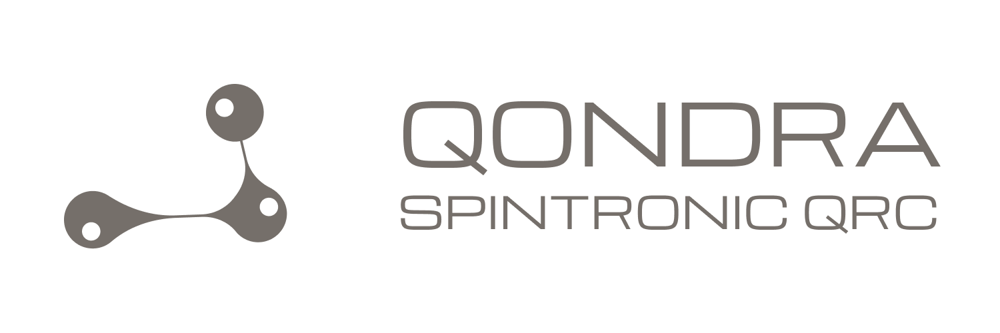

<div align="center">



**Quantum Reservoir Computing with Spin Chain Dynamics**

Part of [ARPA Quantum Logical Systems — QONDRA](https://github.com/arpaqls) &nbsp;·&nbsp; [qondra@arpacorp.net](mailto:qondra@arpacorp.net)

<br>


[](LICENSE)


</div>

---

## What this is

`spintronic-qrc` uses **disordered XXZ spin chains** as fixed quantum reservoirs for
temporal machine learning. The reservoir dynamics belong to the same family of spin
Hamiltonians that describe antiferromagnetic spintronic materials — including **Mn₃Sn**,
which [`spinq-vqe`](https://github.com/ARPAQLS/spinq-vqe) simulates with VQE on a
Kagome lattice. Only a classical Ridge output layer is trained.

Two parallel research threads:

- **Spin-chain QRC:** encode inputs → evolve reservoir → Pauli readout → Ridge regression
  on NARMA-10 and Mackey-Glass benchmarks.
- **Spintronic gate set:** PennyLane gates mapped from Larmor precession, exchange
  coupling, spin-orbit torque, and damping.

## Structure

```
spintronic-qrc/
├── src/spintronic_qrc/
│   ├── reservoir.py   # XXZ chain Hamiltonian + device helpers
│   ├── encoder.py     # Input injection (local / global)
│   ├── readout.py     # Pauli expectation observables
│   ├── trainer.py     # Ridge output layer
│   ├── gates.py       # Spintronic-inspired gate set
│   ├── tasks.py       # NARMA-10, Mackey-Glass generators
│   └── utils.py       # Plotting palette
├── notebooks/         # Research notebooks
├── figures/           # Generated plots
├── data/              # Benchmark CSVs
├── benchmarks/        # Scripts vs classical Echo State Networks
├── docs/              # Guides and API reference → docs/README.md
├── OVERVIEW.md        # Research narrative and literature context
└── REFERENCES.md      # Bibliography
```

## Install

Use the workspace venv at the Spintronics program root:

```bash
# From Spintronics/ (parent of this repo)
.venv\Scripts\activate          # Windows
source .venv/bin/activate       # Linux / macOS

pip install -e "./spintronic-qrc[dev]"
```

**Optional extras:**

| Extra | Packages | When |
|-------|----------|------|
| `[tuning]` | Optuna | Hyperparameter sweeps (N, τ, W) |
| `[open]` | QuTiP | Open-system / Lindblad QRC |
| `[crossval]` | Qiskit + Aer | Cross-validate dynamics vs PennyLane |
| `[viz]` | Plotly | Interactive notebook plots |
| `[notebooks]` | dev + tuning + viz | Typical notebook workflow |
| `[all]` | everything above | Full research stack |

```bash
pip install -e "./spintronic-qrc[notebooks]"
pip install -e "./spintronic-qrc[open,crossval]"   # open-system / validation
```

Requires Python ≥ 3.11. Core: PennyLane 0.39+, JAX, NumPy, SciPy, scikit-learn, Matplotlib.

## Notebooks

| # | Notebook | Notes |
|---|----------|-------|
| 01 | `01_xxz_dynamics.ipynb` | Spin chain time evolution |
| 02 | `02_qrc_narma10.ipynb` | Full QRC pipeline on NARMA-10 |
| 03 | `03_qrc_mackey_glass.ipynb` | Chaotic attractor prediction |
| 04 | `04_memory_capacity.ipynb` | Quantum memory capacity |
| 05 | `05_spintronic_gate_set.ipynb` | Custom gates + depth benchmarks |
| 06 | `06_open_system_qrc.ipynb` | QuTiP + dissipation |

## Tests

```bash
pip install -e "./spintronic-qrc[dev]"
pytest spintronic-qrc/tests/ -v
```

See [`docs/testing.md`](docs/testing.md) for the full guide.

## Docs

→ [`OVERVIEW.md`](OVERVIEW.md) — research narrative, key results, and literature context.  
→ [`docs/README.md`](docs/README.md) — physics background, API reference, notebook guide.  
→ [`REFERENCES.md`](REFERENCES.md) — full bibliography.

## References

See [`REFERENCES.md`](REFERENCES.md) for the full bibliography.  
Key: Fujii & Nakajima (2017), Dambre et al. (2012), Jaeger (2001), Mujal et al. (2021).

---

**License:** MIT &nbsp;·&nbsp; **Contact:** [qondra@arpacorp.net](mailto:qondra@arpacorp.net)
